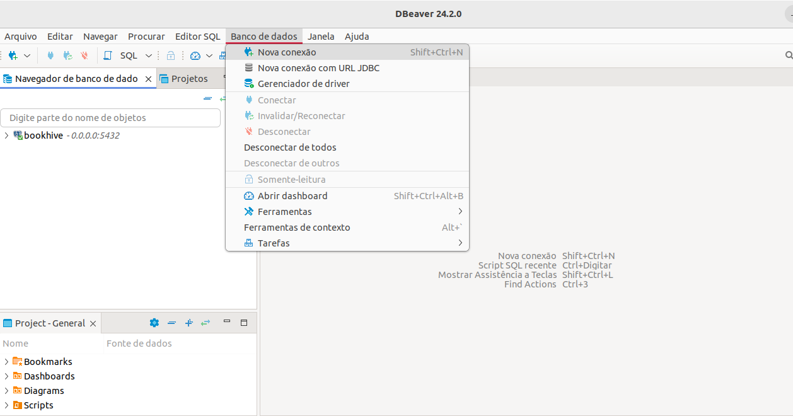

# back-end-book-hive

Este projeto consiste no back-end da aplicação bookhive.

## Pré requisitos

[Java](https://www.oracle.com/br/java/technologies/downloads/)

[Docker Compose](https://docs.docker.com/compose/)

[Banco de dados local Postgres](https://www.edivaldobrito.com.br/dbeaver-no-ubuntu-e-derivados/)


##

Caso seja aprimeira vez, execute

```
Docker compose up --build
```

caso contrário: 

```
Docker compose up
```

Depois disso, vamos utilizar a ferramenta Dbeaver para subir noso banco de dados local. 

Inicie uma nova conexão


Escolha o banco de dados postgreSQL


Utilize as seguintes configurações


Teste a conexão 


Adicione um novo script para criação de tabelas


Depois Execute o script para criação de tabelas


O script para criação pode ser encontrado aqui:
[Script]()

Depois suba a aplicação na IDE de sua preferência.

A documentação sobre os endpoits pode ser encontrada no seguinte link : 

[http://localhost:8080/swagger-ui.html#](http://localhost:8080/swagger-ui.html#)